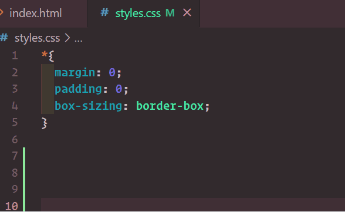

# auto-type-code README

"Auto-Type-Code" is an extension for Visual Studio Code that allows you to type code automatically. 

## Features

This extension is useful for presntations, demos, and tutorials.

You can select a code snippet and type it automatically.




## Contributing

We welcome contributions to the auto-type-code extension! Here are some guidelines to help you get started:

### Contributing Code

1. Fork the repository on GitHub.
2. Create a new branch from `main` (e.g., `feature/my-new-feature`).
3. Make your changes and commit them with clear and descriptive messages.
4. Push your changes to your forked repository.
5. Create a pull request to the `main` branch of the original repository.

### Running the Project and Testing
To run the project and test the extension, follow these steps:

Prerequisites
- Node.js
- Visual Studio Code

Installation
Clone the repository:

```bash
git clone https://github.com/your-username/your-repo-name.git
```

Navigate to the project folder:

```bash
cd your-repo-name
```

Install the dependencies:

```bash
npm install
```

## Running the Extension

Open the project in Visual Studio Code:

```bash
code .
```

Press `F5` or go to the Run and Debug section in VS Code and click Run Extension.
- This will open a new VS Code window with the extension loaded.

## Testing the Extension
1. In the new VS Code window, open a file (e.g., a CSS file).

2. Select a block of code (e.g., a CSS rule).

3. Right-click and choose the "Auto Type" option from the context menu.
    - The extension will delete the selected code and rewrite it character by character, simulating real-time typing.

4. Observe the changes in the editor. The code will be rewritten inside the braces {}, and changes will be saved after each line.

## Debugging
To debug the extension, set breakpoints in your code (e.g., in src/extension.ts).

Use the Run and Debug panel in VS Code to start debugging.

Check the Debug Console for logs and errors.